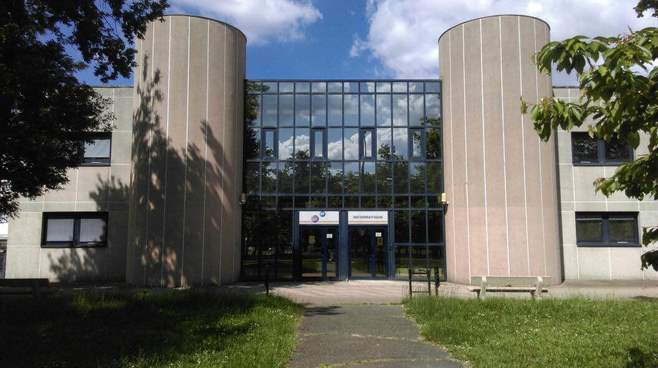

# TP_RUST

NOAM DOUCET - @Doucet-Noam1  
TITOUAN COULON - @coulontitouan
<hr>
Les images sont stockées dans le dossier `images/` et les résultats dans le dossier `images/output`.

## Partie 1:

### Question 1:
```
Créer un nouveau projet Cargo, avec une dépendance sur la bibliothèque image, version 0.24.
```

```bash
cargo new tp_rust
cd tp_rust
echo image = \"0.24\" >> Cargo.toml
```

### Question 2:
```
Pour ouvrir une image depuis un fichier, on utilise ... 
On obtient un DynamicImage, à quoi correspond ce type? 
Comment obtenir une image en mode rbg8 ...
Une image arbitraire peut avoir des pixels de nature différente:
• avec un nombre variables de canaux (couleurs ou non, transparence ou non)
• avec un type de donnée différent pour les canaux (entiers sur un octet, flottants ou autres)
Passer l’image d’entrée en mode rgb8, c’est-à-dire avec 3 canaux R, G, B, représentés chacun par un u8.
```

Pour ouvrir une image depuis un fichier, on utilise la fonction open() du crate image.
```rust
use image::GenericImageView;

let img = image::open("example.jpg").expect("Failed to open image");
```
`A Dynamic Image : This represents a matrix of pixels which are convertible from and to an RGBA representation.`

DynamicImage représente une image chargée en mémoire.

Pour obtenir une image en mode rgb8, on utilise la méthode to_rgb8() de DynamicImage.
```rust
let rgb_image = img.to_rgb8();
```

### Question 3:
```
Sauver l’image obtenue au format png. Que se passe-t-il si l’image de départ avait un canal alpha?
Expliquer dans le README de votre rendu ce qui se passe ici.
```

Le canal alpha est ignoré lors de la sauvegarde de l'image en PNG. Il sera simplement transformé en couleur noire. (logo.png -> rgb_logo.png)

### Question 4:
```
Afficher dans le terminal la couleur du pixel (32, 52) de l’image de votre choix.
```


La couleur du pixel (32, 52) est <span style="color:#346513">couleur #346513</span>, soit 52, 101, 19 en RGB.
```rust
let pixel = img.get_pixel(32, 52);
println!("Pixel (32, 52) : {:?}", pixel);
```
```
Pixel (32, 52) : Rgba([52, 101, 19, 255])
```

### Question 5:
```
Passer un pixel sur deux d’une image en blanc. Est-ce que l’image obtenue est reconnaissable?
```

```rust
let mut halfed_img = img.clone();
for y in 0..halfed_img.height() {
    for x in 0..halfed_img.width() {
        if (x + y) % 2 == 0 {
            halfed_img.put_pixel(x, y, image::Rgb([255, 255, 255]));
        }
    }
}
halfed_img.save("images/output/halfed_image.png");
```

## Partie 2:

### Question 6:
```
Comment récupérer la luminosité d’un pixel?
```

Selon [wikipédia](https://fr.wikipedia.org/wiki/Luminance#Matri%C3%A7age), le luminance relative est calculée par la formule suivante:
```
Y = 0.2126 * R + 0.7152 * G + 0.0722 * B
```
Je vais donc utiliser cette formule pour calculer la luminosité d'un pixel.

### Question 7:
```
Implémenter le traitement
```
```rust
let img = image.to_rgb8(); // L'image de l'iut est un jpg donc on la convertit en rgb8
let mut new_img = img.clone();
for y in 0..img.height() {
    for x in 0..img.width() {
        let pixel = img.get_pixel(x, y);
        let Rgb([r, g, b]) = pixel;
        let luminance = 0.2126 * (*r as f32) + 0.7152 * (*g as f32) + 0.0722 * (*b as f32);
        new_img.put_pixel(x, y, image::Rgb([if luminance > 128.0 { 255 } else { 0 }; 3]));
    }
}

halfed_img.save("images/output/iut_black_and_white.png");
```
 -> 

### Question 8:
```
Permettre à l’utilisateurice de remplacer "noir" et "blanc" par une paire de couleurs au choix.
```
On passe le code de la question 7 dans une fonction qui prend en paramètre les couleurs à utiliser et on appel cette fonction avec les couleurs noires et blanches.
```rust
fn black_and_white_image(image: &image::DynamicImage) -> image::DynamicImage {
    return change_color_palette(&image.clone(), image::Rgb([255; 3]), image::Rgb([0; 3]));
}

fn change_color_palette(image: &image::DynamicImage, color1:image::Rgb<u8>, color2:image::Rgb<u8>) -> image::DynamicImage {
    let img = image.to_rgb8();
    let mut new_img = img.clone();

    for y in 0..img.height() {
        for x in 0..img.width() {
            let pixel = img.get_pixel(x, y);
            let Rgb([r, g, b]) = pixel;
            let luminance = 0.2126 * (*r as f32) + 0.7152 * (*g as f32) + 0.0722 * (*b as f32);
            new_img.put_pixel(x, y, if luminance > 128.0 { color1 } else { color2 });
        }
    }

    image::DynamicImage::ImageRgb8(new_img)
}
```
```rust
let red_and_blue = change_color_palette(&image_iut, image::Rgb([255, 0, 0]), image::Rgb([0, 0, 255]));
red_and_blue.save("images/output/iut_red_and_blue.png").expect("Failed to save image");
```
