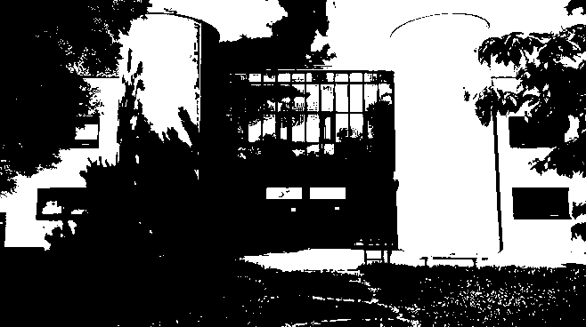

# TP_RUST

NOAM DOUCET - @Doucet-Noam1  
TITOUAN COULON - @coulontitouan

Les images sont stockées dans le dossier `images/` et les résultats dans le dossier `images/output`.

Les codes données dans ce README sont des extraits des codes sources avant refactorisation. Pour voir le code complet et final, veuillez vous référer aux fichiers sources.

## Partie 1:

### Question 1:

```
Créer un nouveau projet Cargo, avec une dépendance sur la bibliothèque image, version 0.24.
```

```bash
cargo new tp_rust
cd tp_rust
echo image = \"0.24\" >> Cargo.toml
```

### Question 2:

```
Pour ouvrir une image depuis un fichier, on utilise ... 
On obtient un DynamicImage, à quoi correspond ce type? 
Comment obtenir une image en mode rbg8 ...
Une image arbitraire peut avoir des pixels de nature différente:
• avec un nombre variables de canaux (couleurs ou non, transparence ou non)
• avec un type de donnée différent pour les canaux (entiers sur un octet, flottants ou autres)
Passer l’image d’entrée en mode rgb8, c’est-à-dire avec 3 canaux R, G, B, représentés chacun par un u8.
```

Pour ouvrir une image depuis un fichier, on utilise la fonction open() du crate image.

```rust
use image::GenericImageView;

let img = image::open("example.jpg").expect("Failed to open image");
```

[Documentation](https://docs.rs/image/latest/image/enum.DynamicImage.html) :
`A Dynamic Image : This represents a matrix of pixels which are convertible from and to an RGBA representation.`

DynamicImage représente une image chargée en mémoire.

Pour obtenir une image en mode rgb8, on utilise la méthode to_rgb8() de DynamicImage.

```rust
let rgb_image = img.to_rgb8();
```

### Question 3:

```
Sauver l’image obtenue au format png. Que se passe-t-il si l’image de départ avait un canal alpha?
Expliquer dans le README de votre rendu ce qui se passe ici.
```

Le canal alpha est ignoré lors de la sauvegarde de l'image en PNG. Il sera simplement transformé en couleur noire (logo.png -> rgb_logo.png), sauf si les canaux rgb des pixels transparents sont définis comme dans le cas de pngalpha qui a donc des pixels de couleur à la place des pixels transparents.

Exemple: 
>Pixel en RGBA(0, 0, 0, 0) -> Pixel en RGB(0, 0, 0)  
Le pixel passe de transparent à noir.  
  
  

>Pixel en RGBA(255, 0, 0, 0) -> Pixel en RGB(255, 0, 0)  
Le pixel passe de rouge transparent à rouge.  
  
  


### Question 4:

```
Afficher dans le terminal la couleur du pixel (32, 52) de l’image de votre choix.
```


La couleur du pixel (32, 52) est <span style="background-color:#346513; color: white;">#346513</span> en hex, soit 52, 101, 19 en RGB.

```rust
let pixel = img.get_pixel(32, 52);
println!("Pixel (32, 52) : {:?}", pixel);
```

```
Pixel (32, 52) : Rgba([8, 8, 8, 255])
```

### Question 5:

```
Passer un pixel sur deux d’une image en blanc. Est-ce que l’image obtenue est reconnaissable?
```


```rust
let mut halfed_img = img.clone();
for y in 0..halfed_img.height() {
    for x in 0..halfed_img.width() {
        if (x + y) % 2 == 0 {
            halfed_img.put_pixel(x, y, image::Rgb([255, 255, 255]));
        }
    }
}
halfed_img.save("images/output/halfed_image.png");
```

## Partie 2:

### Question 6:

```
Comment récupérer la luminosité d’un pixel?
```

Selon [wikipédia](https://fr.wikipedia.org/wiki/Luminance#Matri%C3%A7age), le luminance relative est calculée par la formule suivante:

Y = 0.2126 * R + 0.7152 * G + 0.0722 * B

<!-- ```math
Y = 0.2126 * R + 0.7152 * G + 0.0722 * B
``` -->

Je vais donc utiliser cette formule pour calculer la luminosité d'un pixel.

### Question 7:

```
Implémenter le traitement
```

```rust
let img = image.to_rgb8(); // L'image de l'iut est un jpg donc on la convertit en rgb8
let mut new_img = img.clone();
for y in 0..img.height() {
    for x in 0..img.width() {
        let pixel = img.get_pixel(x, y);
        let Rgb([r, g, b]) = pixel;
        let luminance = 0.2126 * (*r as f32) + 0.7152 * (*g as f32) + 0.0722 * (*b as f32);
        new_img.put_pixel(x, y, image::Rgb([if luminance > 128.0 { 255 } else { 0 }; 3]));
    }
}

halfed_img.save("images/output/iut_black_and_white.png");
```

Avant traitement:


Après traitement:



### Question 8:

```
Permettre à l’utilisateurice de remplacer "noir" et "blanc" par une paire de couleurs au choix.
```

On passe le code de la question 7 dans une fonction qui prend en paramètre les couleurs à utiliser et on appel cette fonction avec les couleurs noires et blanches.

```rust
fn black_and_white_image(image: &image::DynamicImage) -> image::DynamicImage {
    return change_color_palette(&image.clone(), image::Rgb([255; 3]), image::Rgb([0; 3]));
}

fn change_color_palette(image: &image::DynamicImage, color1:image::Rgb<u8>, color2:image::Rgb<u8>) -> image::DynamicImage {
    let img = image.to_rgb8();
    let mut new_img = img.clone();

    for y in 0..img.height() {
        for x in 0..img.width() {
            let pixel = img.get_pixel(x, y);
            let Rgb([r, g, b]) = pixel;
            let luminance = 0.2126 * (*r as f32) + 0.7152 * (*g as f32) + 0.0722 * (*b as f32);
            new_img.put_pixel(x, y, if luminance > 128.0 { color1 } else { color2 });
        }
    }

    image::DynamicImage::ImageRgb8(new_img)
}
```

```rust
let red_and_blue = change_color_palette(&image_iut, image::Rgb([255, 0, 0]), image::Rgb([0, 0, 255]));
red_and_blue.save("images/output/iut_red_and_blue.png").expect("Failed to save image");
```

Résultat avec une palette rouge et bleue :


## Partie 3:

### Question 9:

```
Comment calculer la distance entre deux couleurs? Indiquer dans le README la méthode de calcul choisie.
```

En général, on calcule la distance entre deux couleurs en utilisant la distance euclidienne. C'est la méthode que nous avons choisi d'utiliser.

La distance euclidienne entre deux points (x1, y1) et (x2, y2) est donnée par la formule suivante : 

d = sqrt((x2 - x1)^2 + (y2 - y1)^2)

<!-- ```math
d = \sqrt{(x_2 - x_1)^2 + (y_2 - y_1)^2}
``` -->

### Question 10:

```
Implémenter le traitement
```

```rust
fn distance_euclidienne(&color1: &Rgba<u8>, &color2: &Rgba<u8>) -> f32 {
    let Rgba([r1, g1, b1, _a1]) = color1;
    let Rgba([r2, g2, b2, _a2]) = color2;
    ((r1 as f32 - r2 as f32).powi(2)
        + (g1 as f32 - g2 as f32).powi(2)
        + (b1 as f32 - b2 as f32).powi(2))
    .sqrt()
}

fn set_color_palette(image: &mut image::DynamicImage, palette: Palette) -> () {
    for y in 0..image.height() {
        for x in 0..image.width() {
            let pixel = image.get_pixel(x, y);
            let Rgba([r, g, b, a]) = pixel;
            let mut min_distance = f32::MAX;
            let mut closest_color = Rgba([0, 0, 0, 255]); // On remet le alpha içi vu que chaque couleur à un alpha de 255 et ça fait des données redondantes.

            for palette_color in palette.get_colors() {
                let color = Rgba([palette_color[0], palette_color[1], palette_color[2], 255]);
                let distance = distance_euclidienne(&Rgba([r, g, b, a]), &color);

                if distance < min_distance {
                    min_distance = distance;
                    closest_color = color;
                }
            }

            image.put_pixel(x, y, closest_color);
        }
    }
}
```

Résultat avec une palette de 8 couleurs :


### Question 11:

```
Votre application doit se comporter correctement si on donne une palette vide. Vous expliquerez dans votre README le choix que vous avez fait dans ce cas
```

Plusieurs solutions existent pour gérer une palette vide :
- Ne rien faire et ne pas modifier l'image
- Remplacer chaque pixel par du noir
- Remplacer chaque pixel par du blanc
- Empêcher l'utilisateur de donner une palette vide
- Retourner une erreur

Dans notre projet, une palette est définie par ce code :

```rust
pub struct Palette {
    colors: Vec<Rgb<u8>>,
}

impl Palette {
    pub fn new(colors: Vec<Rgb<u8>>) -> Self {
        Palette { colors }
    }

    pub fn get_colors(&self) -> &Vec<Rgb<u8>> {
        &self.colors
    }

    pub fn add_color(&mut self, color: Rgb<u8>) {
        self.colors.push(color);
    }
}
```

Il suffit donc de vérifier si la palette est vide avant de continuer la fonction et d'implémenter ce qu'on veut comme solution.

```rust
fn set_color_palette(image: &mut image::DynamicImage, /* mut */ palette: Palette) -> () {
    if palette.get_colors().is_empty() {
        // Ne pas modifier l'image
        return;
        // Remplacer par du noir (il faut ajouter rendre palette mutable)
        palette.add_color(Rgb([0, 0, 0]));
        // Remplacer par du blanc ( rendre palette mutable )
        palette.add_color(Rgb([255, 255, 255]));
        // Retourner une erreur
        panic!("Palette vide");
    }
    // ...
}
```

```rust
// Pour empêcher l'utilisateur de donner une palette vide, on modifie l'implémentation de palette
impl Palette {
    pub fn new(colors: Vec<Rgb<u8>>) -> Result<Self, &'static str> {
        if colors.is_empty() {
            Err("Palette cannot be empty")
        } else {
            Ok(Palette { colors })
        }
    }
    // ...
}
```

On a donc choisi de ne pas modifier l'image si la palette est vide pour l'instant mais quand le CLI sera implémenté, l'utilisateur sera averti que la palette ne peut pas être vide.

## Partie 4:

### Question 12:

```
Implémenter le tramage aléatoire des images.
```

Il faut d'abord ajouter la dépendance rand dans le fichier Cargo.toml.

```bash
cargo add rand
```

Ensuite, on fait comme avec la luminance mais on remplace par un nombre aléatoire entre 0 et 1 multiplié par 255.

```rust
use rand::random;

fn set_random_dithering(image: &mut image::DynamicImage) -> () {
    for y in 0..image.height() {
        for x in 0..image.width() {
            let pixel = image.get_pixel(x, y);
            image.put_pixel(
                x,
                y,
                if luminance(&pixel) > random::<f32>() * 255.0 {
                    Rgba([255; 4])
                } else {
                    Rgba([0, 0, 0, 255])
                },
            );
        }
    }
}

fn main() {
    let image_iut = open("images/iut.jpg").expect("Failed to open image");
    let mut iut_dithering = image_iut.clone();
    iut_dithering.set_random_dithering();
    iut_dithering.save("images/output/iut_dithering.png");
}
```

L'image est générée aléatoirement à chaque exécution donc mais voici un exemple :


## Partie 5:

### Question 13:

```
Déterminer 𝐵3.
```

Si Bn est une matrice 