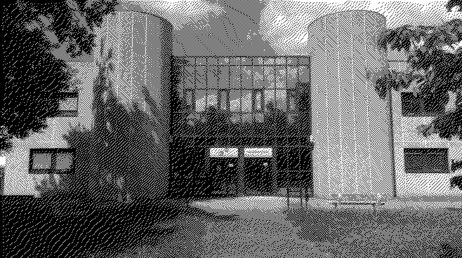

# TP_RUST

NOAM DOUCET - @Doucet-Noam1  
TITOUAN COULON - @coulontitouan

Les images sont stockées dans le dossier `images/` et les résultats dans le dossier `images/output`.

Les codes données dans ce README sont des extraits des codes sources avant refactorisation. Pour voir le code complet et final, veuillez vous référer aux fichiers sources.

A partir de la partie 6, les questions comprennent des matrices qui seront représentées suivant cet exemple :

```math
B_{1} = {\frac{1}{4}}*\begin{bmatrix} 0 & 2 \\ 3 & 1 \end{bmatrix}
```

```
B1 = 1/4 * [[0, 2], [4, 5]]
```

[Lien permanent](https://github.com/coulontitouan/TP_RUST/blob/f7181a8c678e56e164210e3fe4bc3946d91f3bff/README.md)

## Partie 1

### Question 1

```
Créer un nouveau projet Cargo, avec une dépendance sur la bibliothèque image, version 0.24.
```

```bash
cargo new tp_rust
cd tp_rust
cargo add image
```

### Question 2

```
Pour ouvrir une image depuis un fichier, on utilise ImageReader::open("myimage.png")?.decode()?; 
On obtient un DynamicImage, à quoi correspond ce type? Comment obtenir une image en mode rbg8 à partir de ce DynamicImage?

Indiquer les réponses dans votre README.
```

```rust
use image::io::Reader as ImageReader;

fn open_image(path: &str) -> Result<image::DynamicImage, image::ImageError> {
    Ok(ImageReader::open(path)?.decode()?)
}

let image_iut = open_image("images/iut.jpg").expect("Failed to open image");
```

[Documentation](https://docs.rs/image/latest/image/enum.DynamicImage.html) :
`A Dynamic Image : This represents a matrix of pixels which are convertible from and to an RGBA representation.`

DynamicImage représente une image chargée en mémoire.

Pour obtenir une image en mode rgb8, on utilise la méthode to_rgb8() de DynamicImage.

```rust
let rgb_image = image_iut.to_rgb8();
```

### Question 3

```
Sauver l’image obtenue au format png. Que se passe-t-il si l’image de départ avait un canal alpha?
Expliquer dans le README de votre rendu ce qui se passe ici.
```

Le canal alpha est ignoré lors de la sauvegarde de l'image en PNG. Il sera simplement transformé en couleur noire (logo.png -> rgb_logo.png), sauf si les canaux rgb des pixels transparents sont définis comme dans le cas de pngalpha qui a donc des pixels de couleur à la place des pixels transparents.

Exemple: 
>Pixel en RGBA(0, 0, 0, 0) -> Pixel en RGB(0, 0, 0)  
Le pixel passe de transparent à noir.  
  
  

>Pixel en RGBA(255, 0, 0, 0) -> Pixel en RGB(255, 0, 0)  
Le pixel passe de rouge transparent à rouge.  
  
  


### Question 4

```
Afficher dans le terminal la couleur du pixel (32, 52) de l’image de votre choix.
```


La couleur du pixel (32, 52) est <span style="background-color:#346513; color: white;">#346513</span> en hex, soit 52, 101, 19 en RGB.

```rust
use image::GenericImageView;

let pixel = image_iut.get_pixel(32, 52);
println!("Pixel (32, 52) : {:?}", pixel);
```

<div style="page-break-after: always;"></div>

```
Pixel (32, 52) : Rgba([8, 8, 8, 255])
```

### Question 5

```
Passer un pixel sur deux d’une image en blanc. Est-ce que l’image obtenue est reconnaissable?
```


```rust
use image::GenericImage;

let mut half_white_iut = rgb_image.clone();
for (x,y,pixel) in half_white_iut.enumerate_pixels_mut() {
    if (x + y) % 2 == 0 {
        *pixel = Rgb([255, 255, 255]);
    }
}
half_white_iut.save("images/output/half_white.png");
```

## Partie 2

### Question 6

```
Comment récupérer la luminosité d’un pixel?
```

Selon [wikipédia](https://fr.wikipedia.org/wiki/Luminance#Matri%C3%A7age), le luminance relative est calculée par la formule suivante:

```math
Y = 0.2126 * R + 0.7152 * G + 0.0722 * B
```

Je vais donc utiliser cette formule pour calculer la luminosité d'un pixel.

<div style="page-break-after: always;"></div>

### Question 7

```
Implémenter le traitement
```

Pour la suite du projet, nous avons travailler sur des DynamicImage et non sur des ImageBuffer, les boucles se feront donc sur la hauteur/longueur de l'image et non grâce à la méthode enumerate_pixels_mut().

Il n'y a aucune différence à boucler de la sorte.

```rust
let mut new_img = image_iut.to_rgb8().clone(); // L'image de l'iut est un jpg donc on la convertit en rgb8
for y in 0..new_img.height() {
    for x in 0..new_img.width() {
        let pixel = new_img.get_pixel(x, y);
        let image::Rgb([r, g, b]) = pixel;
        let luminance = 0.2126 * (*r as f32) + 0.7152 * (*g as f32) + 0.0722 * (*b as f32);
        new_img.put_pixel(x, y, image::Rgb([if luminance > 128.0 { 255 } else { 0 }; 3]));
    }
}

new_img.save("images/output/iut_black_and_white.png");
```

Avant traitement:


Après traitement:


<div style="page-break-after: always;"></div>

### Question 8

```
Permettre à l’utilisateurice de remplacer "noir" et "blanc" par une paire de couleurs au choix.
```

On passe le code de la question 7 dans une fonction qui prend en paramètre les couleurs à utiliser et on appel cette fonction avec les couleurs noires et blanches.

```rust
fn black_and_white_image(image: &image::DynamicImage) -> image::DynamicImage {
    return change_color_palette(&image.clone(), image::Rgb([255; 3]), image::Rgb([0; 3]));
}

fn change_color_palette(image: &image::DynamicImage, color1:image::Rgb<u8>, color2:image::Rgb<u8>) -> image::DynamicImage {
    let img = image.to_rgb8();
    let mut new_img = img.clone();

    for y in 0..img.height() {
        for x in 0..img.width() {
            let pixel = img.get_pixel(x, y);
            let image::Rgb([r, g, b]) = pixel;
            let luminance = 0.2126 * (*r as f32) + 0.7152 * (*g as f32) + 0.0722 * (*b as f32);
            new_img.put_pixel(x, y, if luminance > 128.0 { color1 } else { color2 });
        }
    }

    new_img
}
```

```rust
let black_and_white = black_and_white_image(&image_iut.clone());
black_and_white.save("images/output/iut_black_and_white.png");

let red_and_blue = change_color_palette(&image_iut.clone(), image::Rgb([255, 0, 0]), image::Rgb([0, 0, 255]));
red_and_blue.save("images/output/iut_red_and_blue.png");
```

Résultat avec une palette rouge et bleue :


## Partie 3

### Question 9

```
Comment calculer la distance entre deux couleurs? Indiquer dans le README la méthode de calcul choisie.
```

En général, on calcule la distance entre deux couleurs en utilisant la distance euclidienne. C'est la méthode que nous avons choisi d'utiliser.

La distance euclidienne entre deux points (x1, y1) et (x2, y2) est donnée par la formule suivante : 

```math
d = \sqrt{(x_2 - x_1)^2 + (y_2 - y_1)^2}
```

### Question 10

```
Implémenter le traitement
```

```rust
fn distance_euclidienne(&color1: &image::Rgba<u8>, &color2: &image::Rgba<u8>) -> f32 {
    let image::Rgba([r1, g1, b1, _a1]) = color1;
    let image::Rgba([r2, g2, b2, _a2]) = color2;
    ((r1 as f32 - r2 as f32).powi(2)
        + (g1 as f32 - g2 as f32).powi(2)
        + (b1 as f32 - b2 as f32).powi(2))
    .sqrt()
}

fn set_color_palette(image: &image::DynamicImage, palette: Palette /*definie plus bas dans le rapport*/) -> image::DynamicImage {
    let mut new_img = image.clone();

    for y in 0..new_img.height() {
        for x in 0..new_img.width() {
            let pixel = new_img.get_pixel(x, y);
            let image::Rgba([r, g, b, a]) = pixel;
            let mut min_distance = f32::MAX;
            let mut closest_color = image::Rgba([0, 0, 0, 255]); // On remet le alpha içi vu que chaque couleur à un alpha de 255 et ça fait des données redondantes.

            for palette_color in palette.get_colors() {
                let color = image::Rgba([palette_color[0], palette_color[1], palette_color[2], 255]);
                let distance = distance_euclidienne(&image::Rgba([r, g, b, a]), &color);

                if distance < min_distance {
                    min_distance = distance;
                    closest_color = color;
                }
            }

            new_img.put_pixel(x, y, closest_color);
        }
    }

    new_img
}
```

```rust
let mut palette = Palette::new(vec![
    image::Rgb([255, 0, 0]),
    image::Rgb([0, 255, 0]),
    image::Rgb([0, 0, 255]),
    image::Rgb([255, 255, 0]),
    image::Rgb([0, 255, 255]),
    image::Rgb([255, 0, 255]),
    image::Rgb([255, 255, 255]),
    image::Rgb([0, 0, 0]),
]);
let iut_palette = set_color_palette(&image_iut.clone(), palette);
iut_palette.save("images/output/iut_palette.png");
```

Résultat avec une palette de 8 couleurs :


### Question 11

```
Votre application doit se comporter correctement si on donne une palette vide. Vous expliquerez dans votre README le choix que vous avez fait dans ce cas
```

Plusieurs solutions existent pour gérer une palette vide :
- Ne rien faire et ne pas modifier l'image
- Remplacer chaque pixel par du noir
- Remplacer chaque pixel par du blanc
- Empêcher l'utilisateur de donner une palette vide
- Retourner une erreur

Dans notre projet, une palette est définie par ce code :

```rust
pub struct Palette {
    colors: Vec<image::Rgb<u8>>,
}

impl Palette {
    pub fn new(colors: Vec<image::Rgb<u8>>) -> Self {
        Palette { colors }
    }

    pub fn get_colors(&self) -> &Vec<image::Rgb<u8>> {
        &self.colors
    }

    pub fn add_color(&mut self, color: image::Rgb<u8>) {
        self.colors.push(color);
    }
}
```

Il suffit donc de vérifier si la palette est vide avant de continuer la fonction et d'implémenter ce qu'on veut comme solution.

```rust
fn set_color_palette(image: &mut image::DynamicImage, /* mut */ palette: Palette) -> () {
    if palette.get_colors().is_empty() {
        // Ne pas modifier l'image
        return;
        // Remplacer par du noir (il faut ajouter mut pour rendre palette mutable)
        palette.add_color(Rgb([0, 0, 0]));
        // Remplacer par du blanc ( rendre palette mutable )
        palette.add_color(Rgb([255, 255, 255]));
        // Retourner une erreur
        panic!("Palette vide");
    }
    // ...
}
```

```rust
// Pour empêcher l'utilisateur de donner une palette vide, on modifie l'implémentation de palette
impl Palette {
    pub fn new(colors: Vec<image::Rgb<u8>>) -> Result<Self, &'static str> {
        if colors.is_empty() {
            Err("Palette cannot be empty")
        } else {
            Ok(Palette { colors })
        }
    }
    // ...
}
```

On a donc choisi de ne pas modifier l'image si la palette est vide pour l'instant mais quand le CLI sera implémenté, l'utilisateur sera averti que la palette ne peut pas être vide.

## Partie 4

### Question 12

```
Implémenter le tramage aléatoire des images.
```

Il faut d'abord ajouter la dépendance rand dans le fichier Cargo.toml.

```bash
cargo add rand
```

Ensuite, on fait comme avec la luminance mais on remplace par un nombre aléatoire entre 0 et 1 multiplié par 255.

```rust
use rand::random;

fn luminance(color: &image::Rgba<u8>) -> f32 {
    let image::Rgba([r, g, b, _a]) = color;
    0.2126 * (*r as f32) + 0.7152 * (*g as f32) + 0.0722 * (*b as f32)
}

fn set_random_dithering(image: &image::DynamicImage) -> image::DynamicImage {
    for y in 0..image.height() {
        for x in 0..image.width() {
            let pixel = image.get_pixel(x, y);
            image.put_pixel(
                x,
                y,
                if luminance(&pixel) > random::<f32>() * 255.0 {
                    image::Rgba([255; 4])
                } else {
                    image::Rgba([0, 0, 0, 255])
                },
            );
        }
    }
}
```

```rust
let iut_dithering = set_random_dithering(&image_iut.clone());
iut_dithering.save("images/output/iut_dithering.png");
```

L'image est générée aléatoirement à chaque exécution donc mais voici un exemple :


## Partie 5

### Question 13

```
Déterminer 𝐵3.
```

B3 est donc une matrice de 8x8 avec des valeurs allant de 0 à 63. Elle est calculée en prenant la matrice B2 et en appliquant la formule donnée dans l'énoncé.

Le bloc supérieur gauche de B3 sera donc la matrice B2 multipliée par 4.

```
[[4*0,  4*8,  4*2,  4*10, ?, ?, ?, ?],  
[ 4*12, 4*4,  4*14, 4*6, ?, ?, ?, ?],  
[ 4*3,  4*11, 4*1,  4*9, ?, ?, ?, ?],  
[ 4*15, 4*7,  4*13, 4*5, ?, ?, ?, ?],  
[?, ?, ?, ?, ?, ?, ?, ?],  
[?, ?, ?, ?, ?, ?, ?, ?],  
[?, ?, ?, ?, ?, ?, ?, ?],  
[?, ?, ?, ?, ?, ?, ?, ?]]
```

Le bloc supérieur droit, 4*B2 + 2.
Le bloc inférieur gauche, 4*B2 + 3.
Le bloc inférieur droit, 4*B2 + 1.

La matrice B3 est divisé par 64 pour obtenir des valeurs entre 0 et 1, ce qui donne une matrice finale B3 :

```math
B_3 = \frac{1}{64} * \begin{bmatrix}
0 & 32 & 8 & 40 & 2 & 34 & 10 & 42 \\
48 & 16 & 56 & 24 & 50 & 18 & 58 & 26 \\
12 & 44 & 4 & 36 & 14 & 46 & 6 & 38 \\
60 & 28 & 52 & 20 & 62 & 30 & 54 & 22 \\
3 & 35 & 11 & 43 & 1 & 33 & 9 & 41 \\
51 & 19 & 59 & 27 & 49 & 17 & 57 & 25 \\
15 & 47 & 7 & 39 & 13 & 45 & 5 & 37 \\
63 & 31 & 55 & 23 & 61 & 29 & 53 & 21
\end{bmatrix}
```

### Question 14

```
Quel type de données utiliser pour représenter la matrice de Bayer? Comment créer une matrice de Bayer d’ordre arbitraire?
```

Pour représenter la matrice de Bayer, on peut utiliser un tableau de tableaux de u8 qu'on divisera par la taille de la matrice au carré.

*Le type de valeur est u8 donc la matrice pourra être d'ordre 4 maximum avant l'overflow. Pour un u16, l'ordre max est 8, etc...*

```rust
struct BayerMatrix {
    matrix: Vec<Vec<u8>>,
}
```

Pour créer une matrice de Bayer d'ordre arbitraire, on doit implémenter une fonction qui génère la matrice en suivant les règles de construction de la matrice de Bayer, soit en étant récursif, soit appelant plusieurs fois la fonction sur la matrice de Bayer de taille inférieure.

```rust
let mut b0 = BayerMatrix {
    matrix: vec![vec![0]],
};

let b1 = get_next_matrix_bayer(b0);
let b2 = get_next_matrix_bayer(b1);
let b3 = get_next_matrix_bayer(b2);
```

Nous avons choisi la récurssion pour générer la matrice de Bayer.

```rust
fn get_bayer_matrix(order: u8) -> BayerMatrix;

let b3 = get_bayer_matrix(3);
```

### Question 15

```
Implémenter le tramage par matrice de Bayer.
```

La fonction récursive qui construit la matrice de Bayer :

```rust
fn get_bayer_matrix(order: u8) -> BayerMatrix {
    if order == 0 {
        return BayerMatrix {
            matrix: vec![vec![0]],
        };
    }

    let matrix = get_bayer_matrix(order - 1).matrix;
    let size = 2_usize.pow(order as u32);
    let mut new_matrix = vec![vec![0; size]; size];

    for y in 0..size {
        for x in 0..size {
            if x < size / 2 && y < size / 2 {
                new_matrix[y][x] = matrix[y][x] * 4;
            } else if x >= size / 2 && y < size / 2 {
                new_matrix[y][x] = matrix[y][x - matrix.len()] * 4 + 2;
            } else if x < size / 2 && y >= size / 2 {
                new_matrix[y][x] = matrix[y - matrix.len()][x] * 4 + 3;
            } else if x >= size / 2 && y >= size / 2 {
                new_matrix[y][x] = matrix[y - matrix.len()][x - matrix.len()] * 4 + 1;
            }
        }
    }

    BayerMatrix { matrix: new_matrix }
}
```

```rust
let b3 = get_bayer_matrix(3);
println!("{:?}", b3.matrix);
```

Le résultat est correct avec nos calculs :

```
[[0, 32, 8, 40, 2, 34, 10, 42], 
[48, 16, 56, 24, 50, 18, 58, 26], 
[12, 44, 4, 36, 14, 46, 6, 38], 
[60, 28, 52, 20, 62, 30, 54, 22], 
[3, 35, 11, 43, 1, 33, 9, 41], 
[51, 19, 59, 27, 49, 17, 57, 25], 
[15, 47, 7, 39, 13, 45, 5, 37], 
[63, 31, 55, 23, 61, 29, 53, 21]]
```

La fonction qui applique le tramage par matrice de Bayer :

```rust
fn set_ordered_dithering(image: &image::DynamicImage, order: u8) -> image::DynamicImage {
    let mut new_img = image.clone();

    let bayer_matrix = get_bayer_matrix(order).matrix;
    let size = 2_usize.pow(order as u32) as u32;

    for y in 0..image.height() {
        for x in 0..image.width() {
            let pixel = image.get_pixel(x, y);
            let threshold = bayer_matrix[(y % size) as usize][(x % size) as usize] as f32 * 255.0
                / (size * size) as f32;

            new_img.put_pixel(
                x,
                y,
                if luminance(&pixel) > threshold {
                    image::Rgba([255; 4])
                } else {
                    image::Rgba([0, 0, 0, 255])
                },
            );
        }
    }

    new_img
}
```

```rust
let dithered_image = set_ordered_dithering(&image_iut, 3);
dithered_image.save("images/output/iut_ordered_dithering.png");
```


## Partie 6

*Les questions de cette partie seront synthétisées en une seule grande réponse.*

Tout le code a été refactorisé pour être plus lisible et plus modulaire.

```rust
mod custom_image {
    use crate::bayer_matrix::BayerMatrix;
    use crate::error_matrix::ErrorMatrix;
    use crate::palette::Palette;
    use crate::{color::Color, custom_image::private_trait::PrivateFunc};
    use image::{DynamicImage, GenericImage, GenericImageView, Rgb, Rgba};
    use rand::random;

    pub trait DynamicImageExtensions {
        fn set_half_pixels_white(&mut self) -> ();
        fn set_color_palette(&mut self, palette: crate::Palette) -> ();
        fn set_black_and_white(&mut self) -> ();
        fn set_monochrome_color_palette(&mut self, color1: Color, color2: Color) -> ();
        fn set_random_dithering(&mut self) -> ();
        fn set_ordered_dithering(&mut self, order: u8) -> ();
        fn apply_error_diffusion(&mut self, palette: &Palette, error_matrix: &ErrorMatrix);
        fn save_image(self, image_name: &str, extension: &str);
        fn save_image_png(self, image_name: &str);
    }

    impl DynamicImageExtensions for DynamicImage {
        // Les fonctions sont implémentées ici.
    }
}
```

Une matrice de diffusion d'erreur est donc représentée par une structure ErrorMatrix, x_origin est la position de l'origine de la matrice par rapport à la position actuelle.

```rust
pub mod error_matrix {
    type MatrixSize = usize;
    type ErrorPrecision = f64;

    pub struct ErrorMatrix {
        pub x_origin: MatrixSize,
        pub matrix: Vec<Vec<ErrorPrecision>>,
    }

    impl ErrorMatrix {
        pub fn new(x_origin: MatrixSize, matrix: Vec<Vec<ErrorPrecision>>) -> Self {
            ErrorMatrix { x_origin, matrix }
        }

        pub fn get_value(&self, row: MatrixSize, col: MatrixSize) -> Option<ErrorPrecision> {
            if row < self.matrix.len() && col < self.matrix[row].len() {
                Some(self.matrix[row][col])
            } else {
                None
            }
        }
    }
}
```

Exemple avec la matrice de Floyd-Steinberg :

```rust 
let floyd_steinberg_error_matrix = ErrorMatrix::new(
    1,
    vec![
        vec![0.0, 0.0, 7.0 / 16.0],
        vec![3.0 / 16.0, 5.0 / 16.0, 1.0 / 16.0],
    ],
);
```

Pour appliquer la diffusion d'erreur, on calcule donc la couleur la plus proche grâce à la distance euclidienne dans la palette en paramètre pour chaque pixel et pour chaque canal (sauf le alpha).

```rust
impl Palette {
    pub fn get_closest_color(&self, color: Rgba<u8>) -> Color {
        let mut min_distance = f32::MAX;
        let mut closest_color = Color::Black;

        for palette_color in self.colors.iter() {
            let Rgb([r, g, b]) = palette_color.rgb();
            let palette_rgba = Rgba([r, g, b, 255]);
            let distance = distance_euclidienne(&color, &palette_rgba);

            if distance < min_distance {
                min_distance = distance;
                closest_color = *palette_color;
            }
        }

        closest_color
    }
    // ...
}
```

Après avoir trouvé la couleur la plus proche, on applique la diffusion d'erreur sur les pixels voisins, en suivant la matrice d'erreur en paramètre.

```rust
fn apply_error_diffusion(&mut self, palette: &Palette, error_matrix: &ErrorMatrix) {
    let width = self.width();
    let height = self.height();

    for y in 0..height {
        for x in 0..width {
            let original_pixel = self.get_pixel(x, y);

            let closest_color = palette.get_closest_color(original_pixel).rgb();

            let error = [
                original_pixel[0] as f32 - closest_color[0] as f32,
                original_pixel[1] as f32 - closest_color[1] as f32,
                original_pixel[2] as f32 - closest_color[2] as f32,
            ];

            let closest_color = Rgba([closest_color[0], closest_color[1], closest_color[2], 255]);
            self.put_pixel(x, y, closest_color);

            for y_error in 0..error_matrix.matrix.len() {
                for x_error in 0..error_matrix.matrix[y_error].len() {
                    let error_value = error_matrix.get_value(y_error, x_error).unwrap();

                    if x as i32 + (x_error as i32 - error_matrix.x_origin as i32) >= 0
                        && x as i32 + (x_error as i32 - error_matrix.x_origin as i32)
                            < width as i32
                        && y + (y_error as u32) < height
                    {
                        let mut error_pixel = self.get_pixel(
                            (x as i32 + (x_error as i32 - error_matrix.x_origin as i32))
                                as u32,
                            y + y_error as u32,
                        );

                        for i in 0..3 {
                            let new_value = (error_pixel[i] as f32
                                + error[i] * error_value as f32)
                                .clamp(0.0, 255.0);
                            error_pixel[i] = new_value as u8;
                        }

                        self.put_pixel(
                            (x as i32 + (x_error as i32 - error_matrix.x_origin as i32))
                                as u32,
                            y + y_error as u32,
                            error_pixel,
                        );
                    }
                }
            }
        }
    }
}
```

La fonction save_image_png() est une fonction d'extension pour DynamicImage qui sauvegarde l'image en PNG.

```rust
let black_and_white_palette = Palette::new(vec![Color::Black, Color::White]);

let basic_error_matrix = ErrorMatrix::new(0, vec![vec![0.0, 0.5], vec![0.5, 0.0]]);

let mut iut_error_diffusion = image_iut.clone();
iut_error_diffusion.apply_error_diffusion(&black_and_white_palette, &basic_error_matrix);
iut_error_diffusion.save_image_png("iut_error_diffusion");
```



```rust
let mut bwrgb_palette = black_and_white_palette.clone();
bwrgb_palette.add_colors(vec![Color::Red, Color::Green, Color::Blue]);

let mut iut_2vois_5coul = image_iut.clone();
iut_2vois_5coul.apply_error_diffusion(&bwrgb_palette, &basic_error_matrix);
iut_2vois_5coul.save_image_png("iut_2vois_5coul");
```


```rust
let floyd_steinberg_error_matrix = ErrorMatrix::new(
    1,
    vec![
        vec![0.0, 0.0, 7.0 / 16.0],
        vec![3.0 / 16.0, 5.0 / 16.0, 1.0 / 16.0],
    ],
);

let david = open("images/david.png").expect("Failed to open image"); // Exemple de wikipédia pour tester la diffusion d'erreur
let mut david_error_floyd_steinberg = david.clone();
david_error_floyd_steinberg.apply_error_diffusion(&black_and_white_palette, &jarvis_judice_ninke_error_matrix);
david_error_floyd_steinberg.save_image_png("david_error_floyd_steinberg");
```

Le résultat avec notre algorisme de diffusion d'erreur :


Le résultat attendu :


Le résulat est très proche de l'original, la différence peut être due à la compression de l'image, à l'arrondi des valeurs par rust lors de la conversion des pixels, ou à une erreur dans l'implémentation de l'algorithme.

Les matrices d'erreur de Jarvis, Judice et Ninke et d'Atkinson sont définies comme suit :

```rust
let jarvis_judice_ninke_error_matrix = ErrorMatrix::new(
    2,
    vec![
        vec![0.0, 0.0, 0.0, 7.0 / 48.0, 5.0 / 48.0],
        vec![3.0 / 48.0, 5.0 / 48.0, 7.0 / 48.0, 5.0 / 48.0, 3.0 / 48.0],
        vec![1.0 / 48.0, 3.0 / 48.0, 5.0 / 48.0, 3.0 / 48.0, 1.0 / 48.0],
    ],
);

let atinkson_error_matrix = ErrorMatrix::new(
    1,
    vec![
        vec![0.0, 0.0, 1.0 / 8.0, 1.0 / 8.0],
        vec![1.0 / 8.0, 1.0 / 8.0, 1.0 / 8.0, 0.0 / 8.0],
        vec![0.0, 1.0 / 8.0, 0.0, 0.0],
    ],
);
```

## Partie 7

### Question 21

Donner une spécification de votre interface sous forme d’un projet d’écran d’aide, tel que celui qui sera obtenu par cargo run -- --help.

```
Usage: TP_RUST.exe [-b] [-i <input>] [-o <output>] [--filter <filter>] [--colors <colors>] [--order <order>] [--error <error>]

Traitement d'image en Rust

Options:
  -b, --build       build readme faire toutes les images du rendu
  -i, --input       chemin du fichier image (Exemple : "images/iut.jpg")
  -o, --output      chemin du fichier de sortie
  --filter          appliquer un filtre (optionnel) filtres disponibles :
                    'half': moitié des pixels en blanc, 'bw': noir et blanc,
                    'pal': change la palette de couleur pour une autre (utiliser
                    l'option colors), 'dither': dithering aléatoire, 'bayer':
                    dithering ordonné (utiliser l'option order), 'error':
                    diffusion d'erreur (utiliser l'option error)
  --colors          liste de couleurs pour la palette : black, white, red,
                    green, blue, yellow, magenta, cyan exemple : "black,white"
  --order           ordre du dithering ordonné exemple : 4
  --error           algorithme de diffusion d'erreur algorithme disponible :
                    'basic', 'floyd-steinberg', 'jarvis-judice-ninke',
                    'atkinson'
  --help, help      display usage information
```

Les commandes suivantes sont donc possibles :

```bash
cargo run -- -b # Pour générer toutes les images du rendu
cargo run -- -i iut.jpg -o iut_half_white --filter half # Les images seront cherchées dans le dossier images et placées dans le dossier images/output au format png.
cargo run -- -i iut.jpg -o iut_black_and_white --filter bw
cargo run -- -i iut.jpg -o iut_red_and_blue --filter pal --colors red,blue
cargo run -- -i iut.jpg -o iut_random_dithering --filter dither
cargo run -- -i iut.jpg -o iut_ordered_dithering --filter bayer --order 3
cargo run -- -i iut.jpg -o iut_error_diffusion --filter error --error basic
```

### Question 22

```
Déterminer le type Rust correspondant à une sélection d’options fournies par l’utilisateur.
```

J'ai supprimé les options redondantes avec la [question 21](#question-21) pour simplifier l'exemple.

```rust
#[derive(FromArgs)]
/// Traitement d'image en Rust
pub struct Args {
    #[argh(switch, short = 'b')]
    pub build: bool,

    #[argh(option, short = 'i')]
    pub input: Option<String>,

    #[argh(option, short = 'o')]
    pub output: Option<String>,

    #[argh(option)]
    pub filter: Option<String>,

    #[argh(option)]
    pub colors: Option<String>,

    #[argh(option)]
    pub order: Option<u8>,

    #[argh(option)]
    pub error: Option<String>,
}
```

### Question 23

L'implémentation est disponible dans ce [fichier](src/argh.rs).
